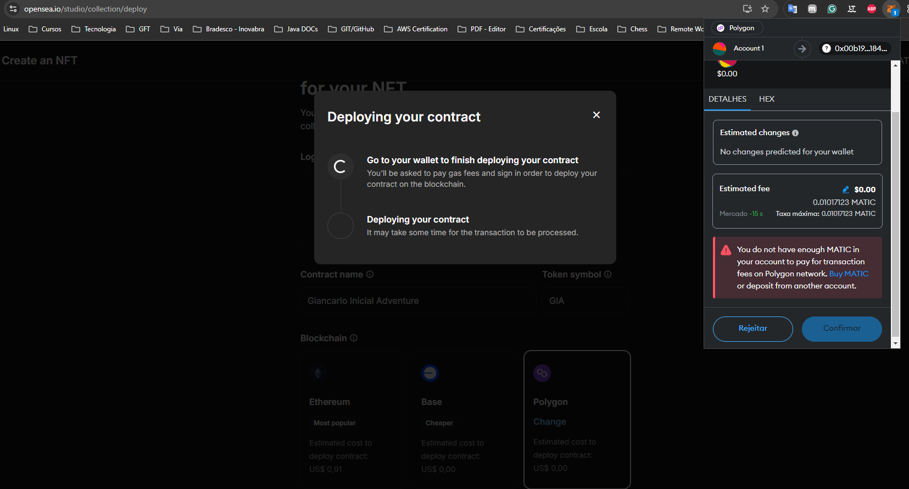
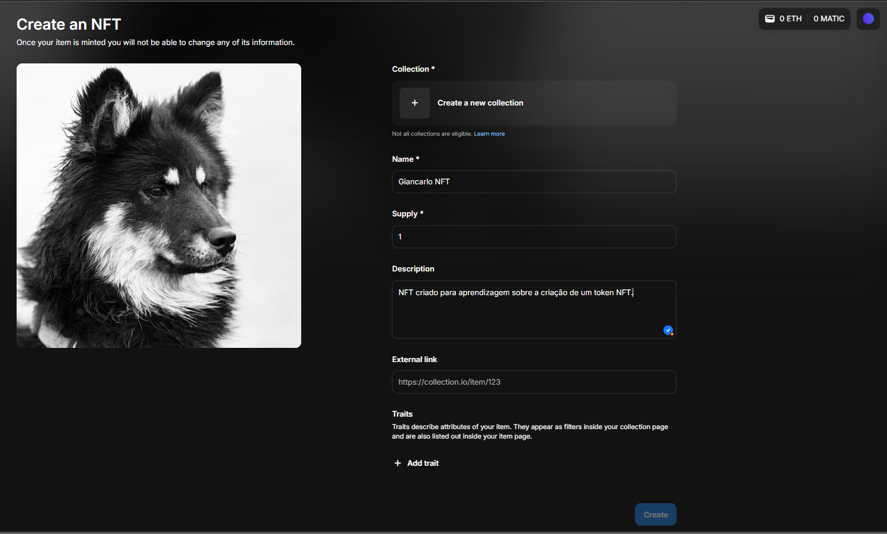
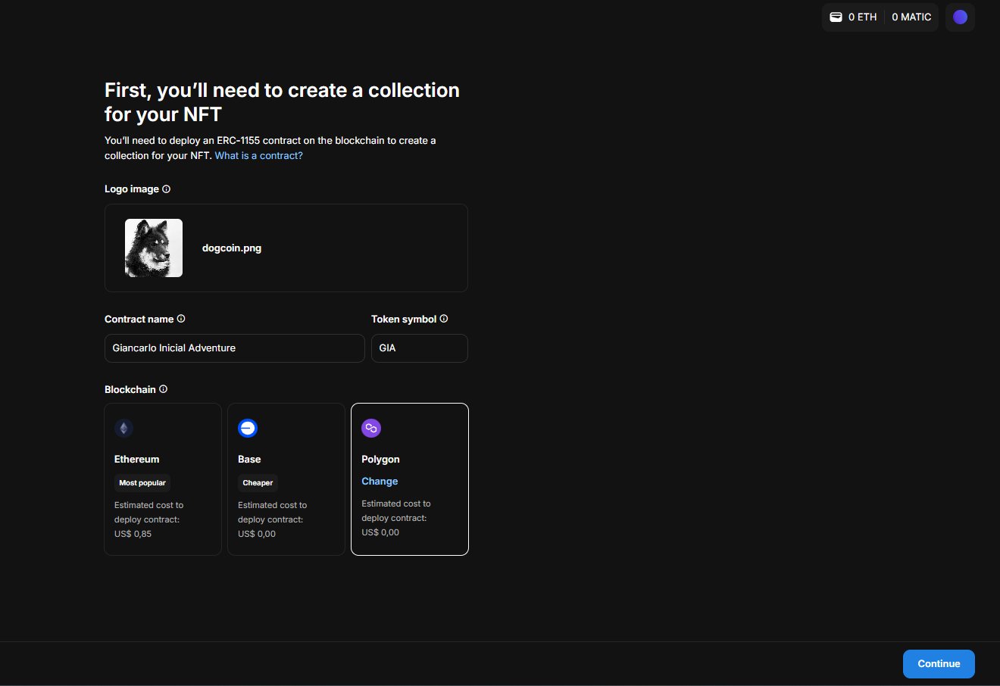

## Criando seu primeiro token NFT - DIO:

- Repositório com informações sobre a criação de um token NFT.

## Criação na Polygon

- Não foi possível criar o Token na Polygon como mnostrado no desafio de projeto, pois, ele data de 2022 e a Polygon exige pagamento de Gas Fee atualmente.

## Passo a passo usado para a criação

# Passo 1

# Passo 2

##### Não foi possível prosseguir além disso sem que ocorresse gasto financeiro.
